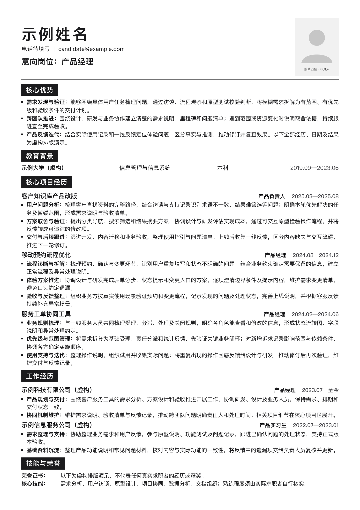

# Resume Polish · 五步单页简历 Skill

把旧简历、零散经历或一段口述，整理成针对目标岗位的中文简历：**单页 A4、黑白极简排版、核心项目充分展开、可加入本人商务照。**

分享的是同一套版式与制作方法。每个人的简历内容来自自己的真实经历，不复制作者或示例的履历。

## 怎么用（五步）

1. [下载 Skill ZIP](https://github.com/Fanghj256/resume-polish/releases/latest/download/resume-polish.zip)，解压后得到 `resume-polish` 文件夹。
2. 把整个文件夹交给能读取文件、执行脚本的 AI Agent，或安装到该 Agent 的 Skills 目录。仅上传 `SKILL.md` 会缺少模板和脚本；普通纯聊天窗口未必能直接导出文件。
3. **先给它一个资料目录**（比如 `我的简历/`）。你的衣柜、素材、投递件全部放在这里，**不放进 Skill 文件夹**——Skill 可以升级覆盖，个人数据不能混进去。
4. 然后按下面五步走。第一步做一次，第 2–5 步每投一个岗位跑一遍：

| 步骤 | 你要做的 | 你会得到 |
| --- | --- | --- |
| **1 建立简历衣柜** | 把经历交给它：旧简历直接丢进来、想到哪说到哪、或指一个文件夹让它自己读 | `简历衣柜/简历衣柜.md` + `简历衣柜.docx`：每段经历按时间段／组织／角色／背景／动作／结果／工具／能力标签建档。**随时可说「记衣柜：…」更新** |
| **2 拆解 JD** | 发目标岗位的 **JD 全文**（或招聘链接、截图） | `01_JD拆解.md`：这个岗位真正在意的 5 项能力、筛选关键词、硬门槛与加分项、JD 自身含糊的地方 |
| **3 选经历**（可跳过） | 它会问你要不要打分；要的话，在你收到的 Excel 里勾「采用」、排「简历顺序」 | `02_经历打分.md` + `.xlsx`：每段经历 1–5 分匹配度、建议采用／压缩／删掉、以及没证据的要求怎么补 |
| **4 生成简历** | 确认选材与顺序 | `投递文件/` 里的 PDF，加 `制作源文件/简历.html`——**双击就能在浏览器里改字**，改完对它说「同步投递件」重新导出 |
| **5 投递前质检** | 把成稿发回，说明投的是哪个岗位（附 JD 原文） | `03_投递前质检.md`：错字、数字来源、敏感信息、缺证据的关键词，附"必须改／建议改／可不改"清单 |

### 每步可以照这样开口

**1 建立简历衣柜**（一次就好）

```text
先建简历衣柜。我的经历在这个文件夹里：【路径／已上传附件】，另外补充几点：【想到什么说什么，记不清的直接跳过】
```

> 没有旧简历也能开始，直接口述即可；它会先把事实整理成衣柜，再集中问缺口。

**2 拆解 JD**

```text
帮我拆解这个岗位：【粘贴 JD 全文】。行业按【互联网内容平台／金融监管／国企综合管理／…】来判。
```

> 只发岗位名称容易拆空——**JD 全文，或招聘链接、截图一起给它**。

**3 经历打分**（它问你要不要打分时这样答）

```text
要，帮我打分。顺便说清楚哪几段建议压缩或删掉，我好在 Excel 里勾。
```

> 不需要就直说「跳过这一步，直接生成」。拿到 `02_经历打分.xlsx` 后，**只改「采用」和「简历顺序」两列**发回来：

```text
Excel 发你了：采用 E01、E03、E05，顺序按 1、2、3，E04 先留着备选。
```

**4 生成简历**

```text
按我勾的生成简历，放到 简历投递/【公司_岗位】/。每段用的是衣柜里哪一条，生成后列一下。
```

> 拿到 HTML 后**双击就能在浏览器里改字**；改完说一句「**同步投递件**」让它重新导出 PDF。（编辑层里有「复制给 Agent 的话」按钮，点一下就这句话进剪贴板。）

**5 投递前质检**

```text
投之前帮我质检：投的是【公司＋岗位】，JD 是【粘贴／链接】。重点看数字站不站得住、有没有 JD 要求但我没有证据的关键词。
```

> 手机号和邮箱不用特意删，它重点查的是身份证号、家庭住址、公司内部资料、他人隐私这类。

赶时间也可以一句话让它先跑：`用 resume-polish 帮我做简历，材料在【路径】，目标是【岗位＋JD】`——它会从建衣柜开始按顺序走完。

照片跟着第 4 步走：有合适的本人照片就放进简历；只有生活照时，按内置商务照流程引导制作；岗位要求无照片或你不想放，都会照办。

## 信息不完整也能开始

不需要先填完整问卷。Agent 会先读已有材料，再对照岗位找缺口，每轮优先问 1–3 个关键问题，例如“这件事你亲自负责哪些环节”“当时怎样做取舍”“最后交付了什么”。你可以直接口述，回答会被整理回对应项目。

记不清数字可以直说；没有数据时可补实际交付物、使用反馈或后续动作。没有做过的事也直接说，Skill 会寻找其他真实经历里的相关能力，不替你编造成果。补充流程见 [信息引导与追问](references/intake-and-follow-up.md)。

## 样式预览

下面是**完全虚构的演示材料**。姓名、公司、学校、项目、日期、数字和照片占位均不代表作者或真实求职者，不可直接用于投递。



可查看 [演示 HTML](examples/demo.html)。用 Chrome/Edge 双击打开，页面顶部就有编辑工具栏：可以点「开启编辑」直接改字、看单页还剩多少毫米、点「隐藏隐私」遮挡手机号邮箱、点「导出 PDF」打印。实际制作时会按你的材料替换内容，并使用本人照片；示例没有任何真人照片。

## 这套 Skill 包含什么

- 岗位职责与经历证据匹配，不只替换意向岗位标题。
- **五步工作流与五个环节的提示词模板**：建立衣柜 → 拆解 JD → 匹配打分 → 写成条目 → 投递前质检。
- **简历衣柜**：把经历结构化建档（时间／组织／角色／背景／动作／结果／工具／能力标签），一次投入、多次复用；新事实随时「记衣柜」回写，投得越多越省事。
- 实践与项目经历的扩写、事实边界、单页内容充实度与溢出处理。
- 固定 A4 模板、含照片页首变体、PDF 渲染与检查脚本。
- 交付的 `简历.html` 自带浏览器编辑层：双击就能改字、看单页余量、隐藏联系方式、导出 PDF 并写回源文件。
- 内置商务照提示词、身份保持和成片检查流程。
- 按公司与岗位整理交付文件的约定。

## 使用环境

需要能读取整个文件夹的 Agent。生成 PDF 使用 Node.js 20+、Playwright 和 Chromium；处理已有 PDF 时可用 Python 3.10+ 与 PyMuPDF。可以把安装和运行交给 Agent，详细命令见 [scripts/README.md](scripts/README.md)。

Skill 不含模型、图像生成服务、账号或 API Key。若环境不支持执行代码，可读取规范帮助写内容，但不能声称已完成 PDF 导出。不同系统字体可能略有差异，最终以实际 PDF 检查为准。

## 隐私

此仓库从空白历史建立，只提供通用方法与虚构示例，不包含作者的真实简历、手机号、邮箱、照片或投递记录。公开作者署名仅为 GitHub 账号。

把个人资料保存在自己的简历项目中；不要上传到本仓库的 Issues、Pull Requests 或示例目录。脚本在本机读取材料并渲染，不把简历上传到服务器；若另行使用云端 Agent 或图像服务，材料由所选服务处理。

**资料目录与 Skill 目录必须分开**：衣柜、素材、投递件属于个人数据，放在你自己指定的资料目录里；Skill 目录只放模板、脚本和文档。Skill 会被升级覆盖、也可能被公开，个人数据混进去就等于同时背上"被覆盖"和"被泄露"两个风险。

照片流程沿用作者独立发布的 `american-business-headshot`，许可保留在 [内置流程目录](references/american-business-headshot/LICENSE)。

## 来源与原创

本仓库是 [xupengli406-del/resume-builder](https://github.com/xupengli406-del/resume-builder) 的二次开发：

- **沿用上游（呈现层）**：A4 单页模板与视觉规范、示例、PDF 导出链路、信息引导追问、商务照流程。
- **本仓库新增（方法与工具层）**：五步工作流、简历衣柜、提示词库、浏览器编辑层、单页量尺与编辑层冒烟脚本、衣柜→Word／打分表→Excel 导出、目录约定与进度卡。

上游的思路是「上传 JD＋经历 → 生成一份简历」；本仓库先把经历沉淀成可复用的衣柜，之后每投一个岗位只跑后面四步。逐项对照见 [ATTRIBUTION.md](ATTRIBUTION.md)，许可范围见 [NOTICE.md](NOTICE.md)（MIT 覆盖本仓库原创部分；沿用部分版权归原作者，已获其同意）。
